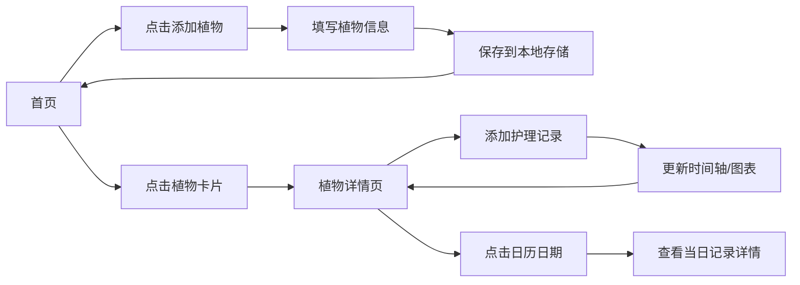

## 1. 产品概述

植物生长记录可视化应用，帮助用户记录和观察家中植物的生长状态。通过时间轴、趋势图和日历热力图等可视化方式，让用户直观了解植物的护理历史和生长趋势。

- **核心目的**：为植物爱好者提供一个安静、清晰的长期记录工具
- **目标用户**：家庭植物养护者，需要记录少量（5-20盆）植物的生长数据
- **产品价值**：通过数据可视化帮助用户建立科学的植物护理习惯

## 2. 核心功能

### 2.1 功能模块

1. **植物管理**：添加/编辑/删除植物基本信息
2. **记录录入**：为每盆植物添加生长记录（浇水、施肥、状态等）
3. **时间轴视图**：按时间顺序展示单株植物的所有生长记录
4. **高度趋势图**：用折线图展示植物高度变化趋势
5. **日历热力图**：按月展示浇水和施肥频率
6. **日记录详情**：点击日历日期查看当天所有护理记录

### 2.3 页面详情

| 页面名称 | 模块名称 | 功能描述 |
|-----------|-------------|---------------------|
| 主页面 | 植物列表 | 展示所有植物卡片，点击进入详情 |
| 主页面 | 添加植物 | 弹窗表单录入植物基本信息 |
| 详情页面 | 植物信息卡 | 展示植物名称、品种、位置等基础信息 |
| 详情页面 | 时间轴 | 按时间倒序展示所有护理记录 |
| 详情页面 | 高度趋势图 | 小型折线图展示高度变化 |
| 详情页面 | 日历热力图 | 月度视图，用颜色深浅表示护理频率 |
| 详情页面 | 添加记录 | 快速录入当日护理记录 |
| 详情页面 | 日期详情 | 点击日期弹窗展示当天所有记录 |

## 3. 核心流程

## 4. 用户界面设计

### 4.1 设计风格

- **主色调**：柔和的鼠尾草绿（#9CAF88）作为主色，搭配米白色背景（#F5F2EB）
- **辅助色**：深橄榄绿（#5C6F4B）用于文字，浅灰绿（#D4DAC9）用于边框
- **强调色**：浅橙色（#E8A87C）用于交互元素
- **按钮风格**：圆润边角（8px），轻微悬浮阴影效果
- **字体**：采用衬线字体（如 Lora）搭配无衬线字体（如 Inter），营造宁静优雅的阅读体验
- **布局风格**：卡片式布局，充足留白，分区清晰
- **图标风格**：线性简约图标，与自然主题契合

### 4.2 页面设计概述

| 页面名称 | 模块名称 | UI 元素 |
|-----------|-------------|-------------|
| 主页面 | 植物列表 | 网格布局卡片，展示植物缩略图、名称、最新记录日期 |
| 详情页面 | 顶部信息区 | 植物名称、品种标签、位置信息，编辑按钮 |
| 详情页面 | 时间轴 | 左侧时间线，右侧记录卡片，含日期、类型、详情 |
| 详情页面 | 趋势图 | 简洁折线图，无多余装饰，突出数据趋势 |
| 详情页面 | 日历热力图 | 月份切换，日期格子颜色深浅表示护理次数 |

### 4.3 响应式

- **桌面优先**设计，主内容区最大宽度 1200px
- **平板适配**：双列布局改为单列，图表自适应缩放
- **移动端**：单列布局，触控友好的按钮尺寸（最小 44px），简化的时间轴展示
