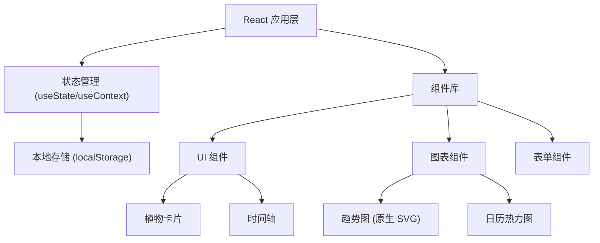
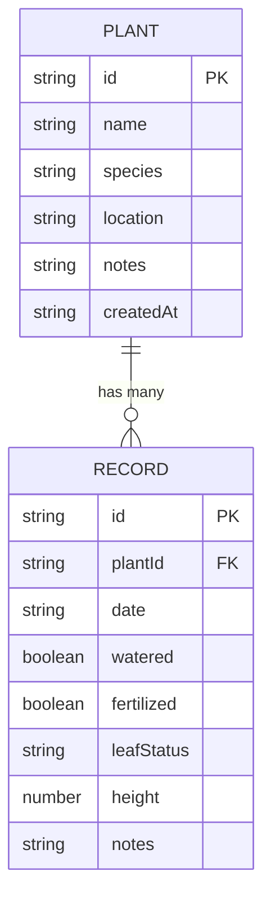

## 1. 架构设计



## 2. 技术描述

- **前端**：React@18 + TypeScript + Vite
- **样式方案**：TailwindCSS@3 + CSS 变量
- **数据存储**：浏览器 localStorage（无后端）
- **图表实现**：原生 SVG 绘制（减少第三方依赖）
- **路由**：React Router@6
- **图标**：Lucide React

## 3. 路由定义

| 路由 | 用途 |
|-------|---------|
| / | 首页 - 植物列表展示 |
| /plant/:id | 植物详情页 - 时间轴、趋势图、日历热力图 |

## 6. 数据模型

### 6.1 数据模型定义



### 6.2 TypeScript 类型定义

```typescript
interface Plant {
  id: string;
  name: string;
  species: string;
  location: string;
  notes: string;
  createdAt: string;
}

interface Record {
  id: string;
  plantId: string;
  date: string;
  watered: boolean;
  fertilized: boolean;
  leafStatus: 'healthy' | 'yellowing' | 'wilting' | 'new_growth' | '';
  height: number;
  notes: string;
}

interface AppData {
  plants: Plant[];
  records: Record[];
}
```

### 6.3 本地存储结构

- **Key**: `plant_tracker_data`
- **Value**: JSON 序列化的 `AppData` 对象

## 7. 核心组件清单

| 组件名 | 路径 | 职责 |
|--------|------|------|
| PlantList | src/components/PlantList.tsx | 展示所有植物卡片 |
| PlantCard | src/components/PlantCard.tsx | 单个植物卡片展示 |
| PlantForm | src/components/PlantForm.tsx | 添加/编辑植物表单 |
| Timeline | src/components/Timeline.tsx | 时间轴展示记录 |
| HeightChart | src/components/HeightChart.tsx | SVG 高度趋势图 |
| CalendarHeatmap | src/components/CalendarHeatmap.tsx | 日历热力图 |
| RecordForm | src/components/RecordForm.tsx | 添加护理记录表单 |
| DayDetails | src/components/DayDetails.tsx | 单日记录详情弹窗 |

## 8. 存储工具函数

| 函数名 | 功能 |
|--------|------|
| loadData | 从 localStorage 加载数据 |
| saveData | 保存数据到 localStorage |
| addPlant | 添加新植物 |
| updatePlant | 更新植物信息 |
| deletePlant | 删除植物及其所有记录 |
| addRecord | 添加护理记录 |
| getRecordsByPlantId | 获取某植物的所有记录 |
| getRecordsByDate | 获取某天的所有记录 |
